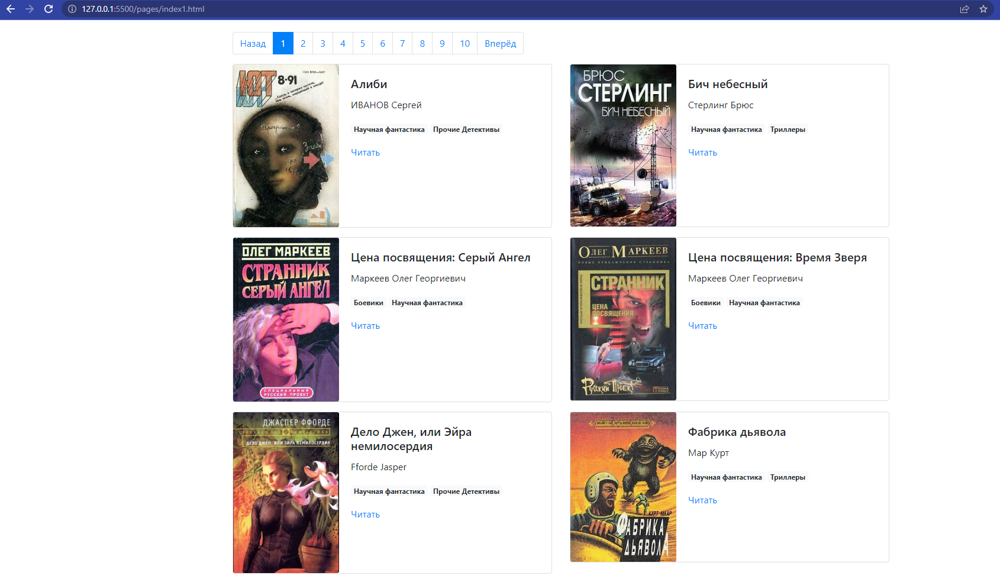

# Online library

Local site with books taken from https://tululu.org/ . Version posted on [github](https://maxhc-vlop.github.io/online_library/pages/index1.html).

## How to install

- Сlone this repository:
```bash
git clone git@github.com:MaxHC-vlop/online_library.git
```

 - You must have python3.9 (or higher) installed.

 - Create a virtual environment on directory project:
 ```bash
python3 -m venv env
 ```
- Start the virtual environment:
```bash
. env/bin/activate
```
- Then use pip to install dependencies:
```bash
pip install -r requirements.txt
```
- [Changing](https://github.com/MaxHC-vlop/online_library_parsing) the library.

## Run
```bash
python3 render_website.py
# you will see
[I 221105 18:19:00 server:335] Serving on http://127.0.0.1:5500
[I 221105 18:19:00 handlers:62] Start watching changes
[I 221105 18:19:00 handlers:64] Start detecting changes
```
Follow the link provided http://127.0.0.1:5500/pages/index1.html:
